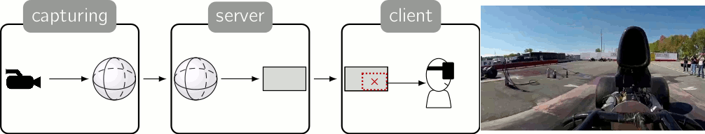
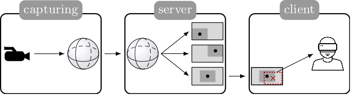
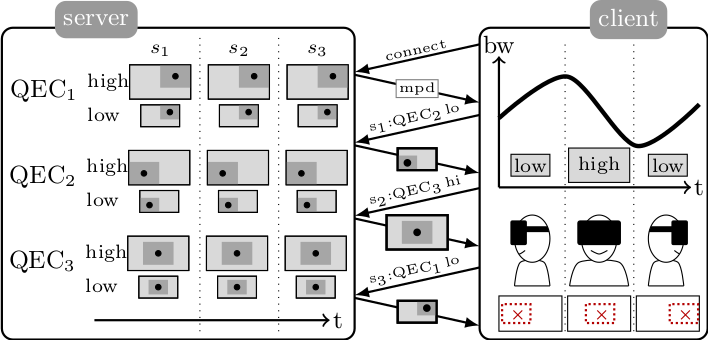
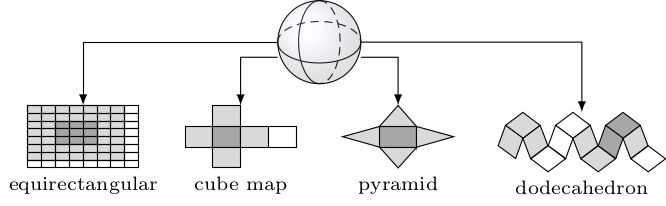
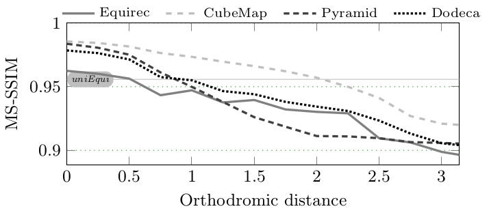
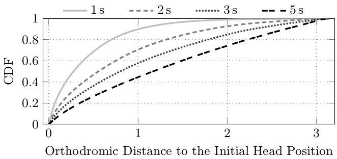
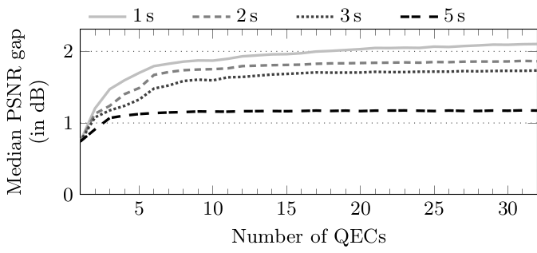

Viewport-Adaptive Navigable 360-Degree Video Delivery
=====================================================

360-Degree video is seen by many as `the next big thing <https://techcrunch.com/2016/06/13/why-vr-is-the-next-big-thing-for-brands/>`_, with the democratization of `omnidirectionnal cameras <https://whichos.com/add-makes-iphone-360-degree-vr-camera/>`_ and Head-Mounted Display (HMD) devices.
A 360-Degree video is an omnidirectionnal video: Images are captured from every direction and are combined into a spherical video.
What is display to the user, which is indifferently
called *Field of View (FoV)* or *viewport*, is only a portion of the full spherical video and depends on in which direction he is watching. `Figure 1`_ illustrates this principle.

To prevent `simulator sickness <http://hfs.sagepub.com/content/53/3/308.short>`_ and to provide good Quality of Experience (QoE), the vendors of HMDs recommend that `the enabling multimedia systems react to head movements as fast as the HMD refresh rate <https://developer.oculus.com/documentation/intro-vr/latest/concepts/bp_intro/>`_.
Since `the refresh rate of state-of-the-art HMDs is 120 Hz <http://www.vrnerds.de/vr-brillen-vergleich/>`_, the whole system should react in less than 10 ms.
Those characteristics make it challenging for service providers to deliver online cloud-based 360-Degree videos since such reaction time is one order of magnitude smaller than what `the most interactive cloud multimedia systems implement <http://peerdal.blogspot.fr/2012/12/brewing-storm-on-cloud-gaming-are-cdns.html>`_.

To maintain interactivity, the state-of-the-art solution is to stream the full spherical video and to let the HMD extract the viewport in real time, according to the user head position.
Therefore the majority of the bandwidth is waste transmitting a portion of the video that is never displayed (two third of the video are dropped in current HMDs with 120-Degree FoV).

  **Figure 1**: 360-Degree delivery

To reduce the bandwidth consumption without impacting the interactivity, we propose a *viewport-adaptive streaming system* that follows the same principles as in rate-adaptive streaming technologies like DASH.
The server offers multiple *representations* of the same 360-degree video but instead of offering representations that only differ by their bit-rate, like for rate-adaptive streaming, the server offers representations that differ by having better quality in a given region of the video. Each video representation is characterized by what we call a *Quality Emphasis Center (QEC)*, which is a given position in the spherical video around which the quality of the video is maximum. The quality of the video is lower for video parts that are far from the QEC. Depending on the user head movement, the client selects the right representation to download.
The whole video is available at the client so it can generate any viewport at any time but the closer from the QEC is the user watching, the higher is the viewport quality. This system is despited in `Figure 2`_.

  **Figure 2**: Viewport-adaptive 360-degree video delivery system:
  The server  offers video representations for three QECs. The dark grey is the part of the video encoded at high quality and the light gray the low quality. The viewport is the dotted red rectangle, the FoV center is the cross

The architecture of our proposed system, illustrated in `Figure 3`_, is very similar to DASH architecture.

**server**
  On the server, the video is split into multiple segments, which size ranges from 1 s to 10 s. Each segment is encoded into different representations. Each representation is characterized by its QEC and its average bit-rate. The server generate a manifest file that contains the description of all segment representations available.

**client**
  Over time the orientation of the user head changes along with the available bandwidth.
  The client can estimate the available bandwidth and can measure the current head orientation using the `Euler angles <https://en.wikipedia.org/wiki/Euler_angles>`_.
  Periodically, the client run an *adaptation algorithm* to choose the new segment representation to download, based on its estimation of the future available bandwidth and on the future position of the user head.
  Then, each time the HMD requires a new frame, the client extracts the viewport from the current segment representation.

The size of the video segments determines how often the client can request for a new representation.
Short segments enable quick adaptation to head movement and bandwidth variations, but increase the overall number of segments, the size of the manifest file, and the network overhead due to the frequent requests. Longer segments improve the overall encoding efficiency of the video codecs but reduce the adaptation flexibility.

  **Figure 3**: Viewort-adaptive streaming system: the
  server offers 6 representations (3 QECs at 2 bit-
  rates).
  The streaming session lasts for three
  segments. The client head moves from left to right,
  while the available bandwidth varies. For each
  segment, the client requests a representation that
  matches both the FoV and the network throughput.
  
The goal of our first study is to answer to the three following question:

- *Which projection layout is the more adapted to viewport-adaptive streaming?*
- *What segment size can be used?*
- *How many QEC representation should be used?*

Current encoders cannot directly encode spherical videos.
They are made to encode rectangular 2D videos.
State-of-the-art 360-Degree videos are projected on a 2D layout using an *equirectangular* projection.
The equirectangular projection is not the only possible projection, as illustrated in `Figure 4`_. In our study we tested the *cube map* projection, the *pyramid* projection and the *rhombic dodecahedron* projection.

  **Figure 4**: Projections into four geometric layouts

We implemented an `open-source C++ software <https://github.com/xmar/360Transformations/tree/master/transformation>`_ that takes a 360-Degree video and projects it onto any 2D layout, with or without a QEC.
To measure the efficiency of each projection, we measure the geodesic distance (named orthodromic distance on a sphere) between the QEC and the center of the FoV, and we measure the quality of the FoV using the MS-SSIM objective quality metric.
From this tool we generated the results from `Figure 5`_.
This Figure shows that the *cube map* projection over-performs other projections.
Moreover it shows that as long as the user stays closer than 1.5 distance units from the QEC, our proposal improves the quality of the extracted viewport compared to the state-of-the-art streaming solution (named uniEqui on this Figure).

  **Figure 5**: Average MS-SSIM depending on the distance to the QEC for the four geometric layouts. Global bit-rate budget 6 Mbps

We used a dataset that contains the head-position of 11 different users watching ten 10 s 360-Degree videos to measure how often a user stays at a specific distance from his original position. We did the measurement for multiple segment lengths and the results are depicted in `Figure 6`_. Those results show that for a 2 s long segment, users stay 80 % of the time at a distance smaller than 1.5 distance units.
This means that with a 2 s long cube map segment, a user will get 80 % of the time a viewport with a better quality compared to what she would get with the state-of-the-art streaming solution.

  **Figure 6**: CDF of the time spent at distance d from the head position on the beginning of the segment, for various segment lengths

The goal of our last experiment is to estimate the number of QECs needed to deliver the best video quality to the user without wasting too much storage at the server.
We computed the average QoE all users from our dataset would have observed with different number of "equi-spread" QECs on the sphere.
The results depicted in `Figure 7`_ show that the average QoE increases with the number of QEC but the gain obtained with more than seven QECs does not justify the extra-cost needed to store them. The best number of QEC is then between five and seven QECs.

  **Figure 7**: Median PSNR gap between the viewports of the cube map layout and the uniEqui depending on the number of QECs. Bit-rate: 6 Mbps
